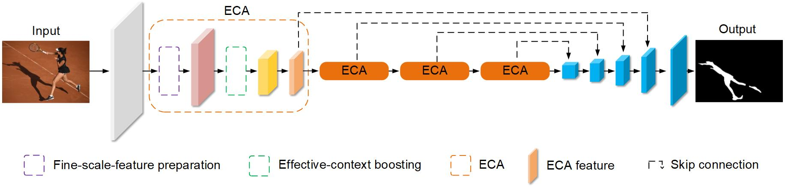
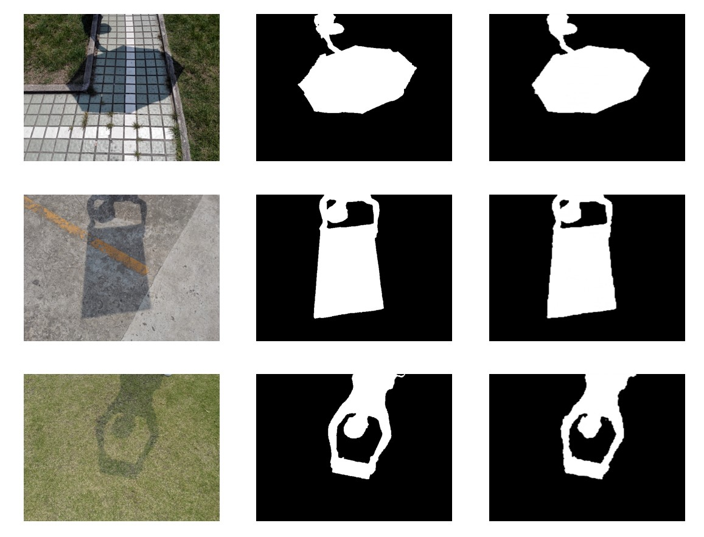

# Robust Shadow Detection by Exploring Effective Shadow Contexts

This repository contains Pytorch code for the paper titled [Robust Shadow Detection by Exploring Effective Shadow Contexts](https://drive.google.com/file/d/1gXgII1DL1XUDhrJYgUeYTbZ_JrXREe6Z/view) at ACM Multimedia 2021.

In this article, we propose a novel end-to-end shadow detection method based on the encoder-decoder structure. Our key contribution is the integration of the regular deep feature with discrimative multi-scale features to fulfil robust shadow augmentation. This integration is obtained by a new module called Effective-Context Augmentation (ECA). 

## Architecture

Attached below is the architecture diagram as given in the paper. Built on the encoder-decoder structure, it takes ECA as the main building block in the encoder while also adopts the features from those ECAs to decode robust shadow classification results.


## Requirements

- Pytorch
- Python3.X
- numpy
- cv2
- PIL

## Usage

- You can search and download the datasets from the Internet.
- ResNext101 has been adopted，and you can download the ResNet101's settings from [here](https://drive.google.com/drive/folders/1qBivnosrTb1PUnB2i89t27oKmSbmDaqP?usp=sharing)，you can put it in the `./` directory.

## Training

```python
python train.py
```

## Testing

```python
python test.py
```

## Results

(Left to right: Input, ground truth, detection result)

More results can be downloaded [here](https://drive.google.com/drive/folders/1OCs8usYDHB2oqNtsZqR5Q8qDXXNjaYWy?usp=sharing).

## Citation
Please cite the following paper if you think this project is useful for your work. Thanks.

@inproceedings{

FangHWS2021Shadow,

author = { Fang, Xianyong and He, Xiaohao and Wang, Linbo and Shen, Jianbing},

booktitle = {Proceedings of the 29th ACM International Conference on Multimedia - ACM Multimedia 2021},

title = {{Robust Shadow Detection by Exploring Effective Shadow Contexts}},

address = {Chengdu, China},

year = {2021}

}
